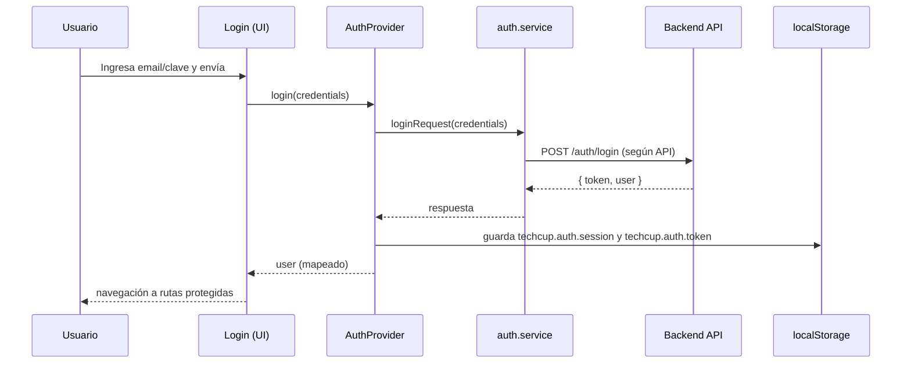

# Documento de Arquitectura — Front End  
**TECHCUP FÚTBOL (Zeus-Codensa)**  
**Curso:** Arquitectura de Software (Front End)  
**Institución:** Escuela Colombiana de Ingeniería  
**Repositorio:** `Zeus-Codensa-Front-End`  
**Fecha:** 2026-04-15  

---

## Índice

1. Introducción  
2. Descripción del servicio (Front End)  
3. Alcance y supuestos  
4. Tecnologías y dependencias principales  
5. Arquitectura lógica del Front End  
   5.1. Enrutamiento y organización por vistas  
   5.2. Autenticación y sesión  
   5.3. Comunicación con el API  
   5.4. UI, componentes y estilo  
6. Funcionalidades (por módulo)  
7. Funcionalidades expuestas (rutas del Front End)  
8. Diagramas  
   8.1. Diagrama de contexto  
   8.2. Diagrama de contenedores / componentes  
   8.3. Secuencia: inicio de sesión  
9. Consideraciones no funcionales  
10. Bibliografía  

---

## 1. Introducción

Este documento describe la arquitectura del **Front End** de TECHCUP FÚTBOL, con énfasis en la estructura del cliente web, su organización por rutas y módulos, el manejo de autenticación y la integración con el API a través de un cliente HTTP centralizado. El objetivo es dejar una base técnica clara para evolución incremental del sistema y para evaluación académica del diseño.

---

## 2. Descripción del servicio (Front End)

El Front End es una aplicación web tipo SPA (Single Page Application) que proporciona la interfaz para los roles del sistema (jugador, capitán, organizador, árbitro) y usuarios no autenticados en el flujo de acceso. La navegación se implementa mediante enrutamiento en el cliente y la interacción con el backend se realiza por medio de peticiones HTTP hacia una URL base configurada por variables de entorno.

**Responsabilidades del Front End**

- Presentar vistas por rol y por módulo (autenticación, equipos, pagos, torneo, resultados, etc.).  
- Administrar el estado de sesión del usuario en el navegador.  
- Consumir el API y transformar errores de red/negocio en feedback consistente para el usuario.  
- Aplicar el sistema visual del producto (ver manual de identidad).  

---

## 3. Alcance y supuestos

**Alcance**

- Arquitectura de navegación (rutas públicas y protegidas).  
- Organización del código por páginas, componentes y servicios.  
- Manejo de sesión con persistencia en `localStorage`.  
- Cliente HTTP con interceptores para autenticación.  

**Supuestos explícitos del repositorio**

- El API se consume desde `VITE_API_BASE_URL` (ver `.env.example`).  
- La autenticación se basa en token tipo *Bearer* persistido en el navegador.  
- La UI se construye a partir de componentes reutilizables y una capa de estilos consistente (Tailwind/MUI/Radix).  

---

## 4. Tecnologías y dependencias principales

**Build y ejecución**

- Vite (dev server y build).  
- React (SPA).  
- TypeScript (tipado y contratos internos).  

**Navegación**

- React Router (`createBrowserRouter`, layouts y rutas anidadas).  

**HTTP / Integración API**

- Axios (instancias y interceptores).  

**UI**

- TailwindCSS (clases utilitarias y animaciones con `tw-animate-css`).  
- MUI (componentes Material y `@emotion/*` como motor de estilos).  
- Radix UI (primitivas accesibles para componentes).  

---

## 5. Arquitectura lógica del Front End

### 5.1. Enrutamiento y organización por vistas

El enrutamiento se define en `src/app/routes.ts` y separa el acceso en:

- **Rutas públicas** bajo `/auth`: login y registro, montadas sobre `PublicLayout`.  
- **Rutas protegidas** bajo `/`: envueltas por `AuthLayout` y luego por `Layout` para navegación general y estructura de la aplicación.  

Este enfoque permite:

- Mantener el *shell* de la aplicación (barra, navegación, contenedor principal) en un único layout.  
- Controlar el acceso a rutas protegidas de forma centralizada.  

### 5.2. Autenticación y sesión

La sesión se administra en `src/app/context/AuthContext.tsx` mediante un `AuthProvider` que expone:

- `user` (identidad y rol).  
- `login`, `logout`, `register`.  
- persistencia de `token` y `user` en `localStorage` (`techcup.auth.session` y `techcup.auth.token`).  

El modelo de usuario incluye atributos que el front usa para personalizar vistas (por ejemplo, datos de jugador o capitán) sin duplicar lógica en cada pantalla.

### 5.3. Comunicación con el API

La comunicación HTTP se implementa con Axios a través de instancias centralizadas:

- `src/app/lib/apiClient.ts`: define `API_BASE_URL`, agrega encabezado `Authorization: Bearer <token>` cuando existe, normaliza errores y limpia sesión en `401`.  
- `src/app/services/http/http.ts`: instancia adicional con `withCredentials` y el mismo esquema de inyección de token desde `localStorage`.  

En ambos casos, la intención arquitectónica es evitar URLs y headers “sueltos” en componentes, concentrando la configuración en un cliente común y reduciendo acoplamiento entre UI y transporte.

### 5.4. UI, componentes y estilo

La aplicación combina:

- componentes de base (UI) reutilizables,  
- composición por páginas (vistas),  
- y un sistema de estilos consistente (Tailwind/MUI/Radix).

El sistema visual se documenta en el manual de identidad: `manual_identidad/manual_identidad.md`.

---

## 6. Funcionalidades (por módulo)

Las funcionalidades se organizan por rol y módulo (según páginas bajo `src/app/pages/`):

- **Autenticación:** login y registro (`Login`, `Register`).  
- **Inicio y navegación general:** `Home`, `Dashboard`.  
- **Jugador:** configuración de perfil y búsqueda de equipo (`player/ProfileSetup`, `player/FindTeam`).  
- **Capitán:** creación de equipo e invitación de jugadores (`captain/CreateTeam`, `captain/InvitePlayers`).  
- **Organizador:** tablero y gestión de torneo (crear torneo, gestionar equipos, programar partidos, registrar resultados, aprobar pagos).  
- **Árbitro:** agenda / programación (`referee/RefereeSchedule`).  
- **Consulta general:** torneos, posiciones, partidos, equipos, llaves (`Tournaments`, `Standings`, `Matches`, `Teams`, `TournamentBrackets`).  
- **Pagos:** portal de pagos (`PaymentPortal`).  

---

## 7. Funcionalidades expuestas (rutas del Front End)

Rutas principales definidas en `src/app/routes.ts`:

**Públicas**

- `/auth/login`  
- `/auth/register`  

**Protegidas**

- `/` (Home)  
- `/dashboard`  
- `/profile`  
- `/lineup`  
- `/payment`  
- `/brackets`  
- `/tournaments`  
- `/standings`  
- `/matches`  
- `/teams`  
- `/player/profile-setup`  
- `/player/find-team`  
- `/captain/create-team`  
- `/captain/invite-players`  
- `/organizer/dashboard`  
- `/organizer/create-tournament`  
- `/organizer/manage-teams`  
- `/organizer/schedule-matches`  
- `/organizer/register-results`  
- `/organizer/approve-payments`  
- `/referee/schedule`  

---

## 8. Diagramas

### 8.1. Diagrama de contexto

```mermaid
flowchart LR
  U[Usuario (navegador)] -->|HTTPS| FE[Front End SPA (Vite + React)]
  FE -->|HTTP/JSON\nVITE_API_BASE_URL| API[Backend API]
  FE -->|localStorage\nsesión/token| LS[(Almacenamiento local)]
```

### 8.2. Diagrama de contenedores / componentes

```mermaid
flowchart TB
  subgraph FE[Front End]
    Router[React Router\ncreateBrowserRouter]
    Auth[AuthProvider\nAuthContext]
    Layouts[Layouts\nPublicLayout / AuthLayout / Layout]
    Pages[Páginas\nsrc/app/pages/*]
    UI[UI Components\nMUI + Radix + Tailwind]
    Http[HTTP Client\nAxios (apiClient/http)]
  end

  Router --> Layouts --> Pages --> UI
  Pages --> Auth
  Pages --> Http
  Auth --> Http
  Http --> API[(Backend API)]
```

### 8.3. Secuencia: inicio de sesión



---

## 9. Consideraciones no funcionales

- **Seguridad de sesión:** el token se conserva en `localStorage` para persistencia; se limpia en `401` desde el interceptor del cliente HTTP.  
- **Mantenibilidad:** rutas centralizadas y layouts separados reducen duplicación; el cliente HTTP evita acoplamiento entre componentes y transporte.  
- **Experiencia de usuario:** los estados de carga/éxito/error se estandarizan (ver manual de identidad).  
- **Configuración por entorno:** `VITE_API_BASE_URL` permite cambiar backend sin modificar el código.  

---

## 10. Bibliografía

- React. Documentación oficial: `https://react.dev/`  
- Vite. Documentación oficial: `https://vite.dev/`  
- React Router. Documentación oficial: `https://reactrouter.com/`  
- Axios. Repositorio y documentación: `https://axios-http.com/`  
- Tailwind CSS. Documentación oficial: `https://tailwindcss.com/`  
- MUI. Documentación oficial: `https://mui.com/`  
- Radix UI. Documentación oficial: `https://www.radix-ui.com/`  

