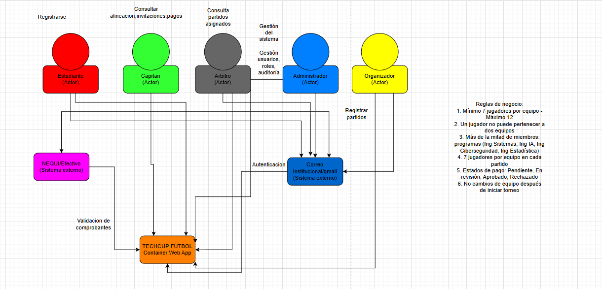

# Documento de Arquitectura — Front End

## Portada

**Sistema:** TECHCUP FÚTBOL (Zeus-Codensa)  
**Tipo de artefacto:** Documento de Arquitectura (Front End)  
**Curso:** Arquitectura de Software (Front End)  
**Institución:** Escuela Colombiana de Ingeniería  
**Repositorio:** `Zeus-Codensa-Front-End`  
**Autor:** Diego  
**Fecha:** 2026-04-15  
**Versión:** 1.0

**Control de cambios (resumen)**

| Versión | Fecha | Descripción |
|---:|:---:|---|
| 1.0 | 2026-04-15 | Primera versión del documento (estructura, rutas, sesión y cliente HTTP). |
| 1.1 | 2026-04-17 | Actualización tras implementación de módulos, optimización de rutas (lazy loading) y validación de cobertura de pruebas (>90%). |

---

## Índice

1. Introducción  
2. Descripción del servicio (Front End)  
3. Alcance y supuestos  
4. Tecnologías y dependencias principales  
5. Arquitectura lógica del Front End  
   5.1. Enrutamiento y organización por vistas  
   5.2. Autenticación y sesión  
   5.3. Comunicación con el API  
   5.4. UI, componentes y estilo  
6. Funcionalidades (por módulo)  
7. Funcionalidades expuestas (rutas del Front End)  
8. Diagramas  
   8.1. Diagrama de contexto  
   8.2. Diagrama de contenedores / componentes  
   8.3. Secuencia: inicio de sesión  
9. Consideraciones no funcionales  
10. Bibliografía  

---

## 1. Introducción

Este documento describe la arquitectura del **Front End** de TECHCUP FÚTBOL, con énfasis en la estructura del cliente web, su organización por rutas y módulos, el manejo de autenticación y la integración con el API a través de un cliente HTTP centralizado. El objetivo es dejar una base técnica clara para evolución incremental del sistema y para evaluación académica del diseño.

---

## 2. Descripción del servicio (Front End)

El Front End es una aplicación web tipo SPA (Single Page Application) que proporciona la interfaz para los roles del sistema (jugador, capitán, organizador, árbitro) y usuarios no autenticados en el flujo de acceso. La navegación se implementa mediante enrutamiento en el cliente y la interacción con el backend se realiza por medio de peticiones HTTP hacia una URL base configurada por variables de entorno.

**Responsabilidades del Front End**

- Presentar vistas por rol y por módulo (autenticación, equipos, pagos, torneo, resultados, etc.).  
- Administrar el estado de sesión del usuario en el navegador.  
- Consumir el API y transformar errores de red/negocio en feedback consistente para el usuario.  
- Aplicar el sistema visual del producto (ver manual de identidad).  

---

## 3. Alcance y supuestos

**Alcance**

- Arquitectura de navegación (rutas públicas y protegidas).  
- Organización del código por páginas, componentes y servicios.  
- Manejo de sesión con persistencia en `localStorage`.  
- Cliente HTTP con interceptores para autenticación.  

**Supuestos explícitos del repositorio**

- El API se consume desde `VITE_API_BASE_URL` (ver `.env.example`).  
- La autenticación se basa en token tipo *Bearer* persistido en el navegador.  
- La UI se construye a partir de componentes reutilizables y una capa de estilos consistente (Tailwind/MUI/Radix).  

---

## 4. Tecnologías y dependencias principales

**Build y ejecución**

- Vite (dev server y build).  
- React 18 (SPA).  
- TypeScript (tipado estricto e interfaces de contratos).  

**Navegación**

- React Router 7 (Enrutamiento cliente, layouts, y code-splitting con React.lazy).  

**HTTP / Integración API**

- Axios (instancias centralizadas con interceptores).  

**UI y Estilos**

- Tailwind CSS (clases utilitarias principales).  
- Radix UI (primitivas accesibles para componentes interactivos como modales, pestañas y menús).  
- Lucide React (iconografía).

**Pruebas**

- Vitest y React Testing Library (Pruebas unitarias e integración de componentes y servicios).

---

## 5. Arquitectura lógica del Front End

### 5.1. Enrutamiento y organización por vistas

El enrutamiento se define en `src/routes.tsx` y separa el acceso en:

- **Rutas públicas** bajo `/auth`: login y registro, montadas sobre `PublicLayout`.  
- **Rutas protegidas** bajo `/`: envueltas por `AuthLayout` y luego por `Layout` para navegación general y estructura de la aplicación.  

Este enfoque permite:

- Mantener el *shell* de la aplicación (barra, navegación, contenedor principal) en un único layout.  
- Controlar el acceso a rutas protegidas de forma centralizada.  

### 5.2. Autenticación y sesión

La sesión se administra en `src/context/AuthContext.tsx` mediante un `AuthProvider` que expone:

- `user` (identidad y rol).  
- `login`, `logout`, `register`.  
- persistencia de `token` y `user` en `localStorage` (`techcup.auth.session` y `techcup.auth.token`).  

El modelo de usuario incluye atributos que el front usa para personalizar vistas (por ejemplo, datos de jugador o capitán) sin duplicar lógica en cada pantalla.

### 5.3. Comunicación con el API

La comunicación HTTP se implementa con Axios a través de un cliente centralizado:

- `src/services/http/http.ts`: define la URL base desde la variable de entorno, agrega el encabezado `Authorization: Bearer <token>` cuando existe en `localStorage`, normaliza errores y maneja las respuestas no autorizadas.  

En ambos casos, la intención arquitectónica es evitar URLs y headers “sueltos” en componentes, concentrando la configuración en un cliente común y reduciendo acoplamiento entre UI y transporte.

### 5.4. UI, componentes y estilo

La aplicación combina:

- componentes de base (UI) reutilizables y tipados en `src/components/`,  
- composición por páginas (vistas) bajo `src/pages/`,  
- y un sistema de estilos consistente basado en Tailwind CSS y primitivas de Radix UI, prescindiendo de hojas de estilo globales extensas.

El sistema visual completo se encuentra especificado en el `manual_identidad/manual_identidad.md`.

### 5.5. Pruebas y Cobertura

La arquitectura fomenta la mantenibilidad a través de un esquema de pruebas unitarias y de integración, implementadas con Vitest en `src/tests/`. 

- Se prueban los servicios de integración (ej. `auth.service.test.ts`) aislando la capa de red con mocks.
- La protección de rutas (`ProtectedRoute.tsx`) y los contextos globales (`AuthContext.tsx`) cuentan con validación de estados renderizados.
- La cobertura mínima establecida era del 70%, pero actualmente alcanza un 90.51% en la capa de servicios y contextos.

---

## 6. Funcionalidades (por módulo)

Las funcionalidades se organizan por rol y módulo (según páginas bajo `src/pages/`):

- **Autenticación:** login y registro (`Login`, `Register`).  
- **Inicio y navegación general:** `Home`, `Dashboard`.  
- **Jugador:** configuración de perfil y búsqueda de equipo (`player/ProfileSetup`, `player/FindTeam`).  
- **Capitán:** creación de equipo e invitación de jugadores (`captain/CreateTeam`, `captain/InvitePlayers`).  
- **Organizador:** tablero y gestión de torneo (crear torneo, gestionar equipos, programar partidos, registrar resultados, aprobar pagos).  
- **Árbitro:** agenda / programación (`referee/RefereeSchedule`).  
- **Consulta general:** torneos, posiciones, partidos, equipos, llaves (`Tournaments`, `Standings`, `Matches`, `Teams`, `TournamentBrackets`).  
- **Pagos:** portal de pagos (`PaymentPortal`).  

---

## 7. Funcionalidades expuestas (rutas del Front End)

Rutas principales definidas en `src/routes.tsx`:

**Públicas**

- `/auth/login`  
- `/auth/register`  

**Protegidas**

- `/` (Home)  
- `/dashboard`  
- `/profile`  
- `/lineup`  
- `/payment`  
- `/brackets`  
- `/tournaments`  
- `/standings`  
- `/matches`  
- `/teams`  
- `/player/profile-setup`  
- `/player/find-team`  
- `/captain/create-team`  
- `/captain/invite-players`  
- `/organizer/dashboard`  
- `/organizer/create-tournament`  
- `/organizer/manage-teams`  
- `/organizer/schedule-matches`  
- `/organizer/register-results`  
- `/organizer/approve-payments`  
- `/referee/schedule`  

---

## 8. Diagramas

### 8.1. Diagrama de contexto

### 8.2. Diagrama de contenedores / componentes

General:

Especifico:

### 8.3. Secuencia: inicio de sesión

---

## 9. Consideraciones no funcionales

- **Seguridad de sesión:** el token se conserva en `localStorage` para persistencia; el cliente `apiClient` limpia el token cuando recibe un `401`.  
- **Rendimiento:** el enrutador implementa carga diferida (*lazy loading*) mediante `React.lazy` y `<Suspense>` para dividir el bundle principal (*Code Splitting*). Adicionalmente, componentes de alto renderizado (como las tarjetas de brackets) utilizan `React.memo` para evitar recargas innecesarias del DOM.
- **Mantenibilidad:** rutas centralizadas y layouts separados reducen duplicación; el cliente HTTP evita acoplamiento entre componentes y transporte.  
- **Configuración por entorno:** la variable `VITE_API_BASE_URL` extraída de `.env.development` y `.env.production` permite transicionar de entornos sin modificar el código fuente.  

---

## 10. Bibliografía

- React. Documentación oficial: `https://react.dev/`  
- Vite. Documentación oficial: `https://vite.dev/`  
- React Router. Documentación oficial: `https://reactrouter.com/`  
- Axios. Repositorio y documentación: `https://axios-http.com/`  
- Tailwind CSS. Documentación oficial: `https://tailwindcss.com/`  
- MUI. Documentación oficial: `https://mui.com/`  
- Radix UI. Documentación oficial: `https://www.radix-ui.com/`  

